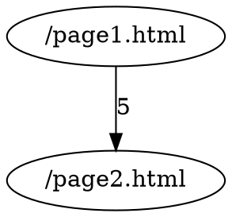

# Analog - Analyseur de Logs Apache

## Description

`analog` est un outil d'analyse de fichiers de logs Apache qui permet de :
- Afficher le top 10 des documents les plus consultés
- Générer un graphe de navigation entre les pages (format GraphViz)
- Filtrer les logs par heure
- Exclure les ressources statiques (images, CSS, JS, etc.)

## Compilation

Le projet utilise un Makefile. Pour compiler :

```bash
make
```

Cela génère l'exécutable `analog`.

### Nettoyage

```bash
make clean      # Supprime les fichiers objets et l'exécutable
make mrproper   # Nettoyage complet (incluant les fichiers .dot et .png générés)
```

## Utilisation

### Syntaxe

```bash
./analog [options] fichier.log
```

### Options

- `-g <fichier.dot>` : Génère un fichier GraphViz représentant le graphe de navigation
- `-e` : Exclut les ressources statiques (.jpg, .jpeg, .png, .gif, .css, .js, .ico, etc.)
- `-t <heure>` : Filtre les logs sur une heure spécifique (0-23)

### Exemples

**Analyse simple :**
```bash
./analog anonyme.log
```

**Analyse avec exclusion des ressources statiques :**
```bash
./analog -e anonyme.log
```

**Génération d'un graphe de navigation :**
```bash
./analog -g graph.dot anonyme.log
```

**Filtrage par heure (logs de 11h à 11h59) :**
```bash
./analog -t 11 anonyme.log
```

**Toutes les options combinées :**
```bash
./analog -g graph.dot -e -t 11 anonyme.log
```

## Génération de l'image du graphe

Si GraphViz est installé, vous pouvez générer une image PNG du graphe :

```bash
dot -Tpng graph.dot -o graph.png
```

Ou utiliser la cible Make :

```bash
make test-graph
```

## Tests

### Framework de test automatique

Un framework de test complet est fourni dans le répertoire `Tests/`. Ce framework permet de valider automatiquement le bon fonctionnement du programme en exécutant des jeux de tests et en vérifiant :
- Le code de retour du programme
- La sortie standard (stdout)
- Les fichiers générés

#### Structure des tests

Chaque test se trouve dans un répertoire `Tests/TestAnalogN/` et contient :

- **`description`** : Description textuelle du test
- **`run`** : Commande à exécuter (relative à la racine du projet)
- **`returncode`** : Code de retour attendu (optionnel)
- **`std.out`** : Sortie standard attendue (optionnel)
- **`*.outfile`** : Fichiers à générer (optionnel)
- **`test.log`** : Fichier de log de test

#### Tests disponibles

| Test | Description | Options |
|------|-------------|---------|
| **TestAnalog1** | Exécution basique | Aucune |
| **TestAnalog2** | Exclusion ressources statiques | `-e` |
| **TestAnalog3** | Filtre par heure | `-t 14` |
| **TestAnalog4** | Génération fichier GraphViz | `-g graph.dot` |
| **TestAnalog5** | Erreur fichier inexistant | Code retour 1 |
| **TestAnalog6** | Erreur heure invalide | `-t 25` |
| **TestAnalog7** | Combinaison d'options | `-e -t 10` |
| **TestAnalog8** | Toutes options combinées | `-g -e -t 9` |
| **TestAnalog9** | Aucun argument | Code retour 1 |
| **TestAnalog10** | Fichier log vide | Aucune |

#### Exécuter les tests

**Prérequis :**
```bash
cd Tests
chmod +x test.sh mktest.sh
```

**Exécuter un test individual :**
```bash
cd Tests
./test.sh TestAnalog1
```

**Exécuter tous les tests :**
```bash
cd Tests
./mktest.sh
```

Le script `mktest.sh` exécute tous les tests et affiche un résumé :
```
Passed tests     : 8
Failed tests     : 2
Misformed tests  : 0
-----------------------
Total            : 10
```

Les résultats sont également enregistrés dans `results.csv` pour analyse ultérieure.

### Tests avec Makefile

Le Makefile fournit également plusieurs cibles de test :

```bash
make test-mini      # Test avec le petit fichier d'exemple
make test-full      # Test avec le fichier complet anonyme.log
make test-graph     # Test avec génération de graphe
make test-options   # Test de toutes les options
```

## Structure du projet

```
TP4_Cpp/
├── analog.cpp              # Programme principal
├── DateTime.h/.cpp         # Gestion de date/heure
├── LogEntry.h/.cpp         # Représentation d'une ligne de log
├── Document.h/.cpp         # Représentation d'un document web
├── LogParser.h/.cpp        # Parsing du fichier de logs
├── Analyzer.h/.cpp         # Analyse et statistiques
├── GraphGenerator.h/.cpp   # Génération du graphe GraphViz
├── Options.h/.cpp          # Gestion des options CLI
├── Makefile                # Script de compilation
├── exemple-mini-non-exhaustif.txt  # Fichier de test
└── anonyme.log             # Fichier de logs complet
```

## Architecture

L'application est structurée en 7 classes principales :

1. **DateTime** : Parse et stocke une date/heure du format Apache
2. **LogEntry** : Représente une entrée de log avec tous ses champs
3. **Document** : Représente un document web avec son compteur de hits
4. **LogParser** : Parse le fichier de logs ligne par ligne
5. **Analyzer** : Analyse les logs et applique les filtres
6. **GraphGenerator** : Génère le fichier GraphViz .dot
7. **Options** : Parse les options de la ligne de commande


```

## Format du graphe

Le fichier `.dot` généré suit la syntaxe GraphViz :



Les nœuds représentent les pages web, et les arcs les transitions entre pages avec le nombre d'occurrences.

## Exemples de résultats

### Top 10 des documents

```
Top 10 des documents les plus consultés :
---------------------------------------------------
/SiteWebIF/Intranet-etudiant.php (406 hits)
/notesif/ (150 hits)
/temps/ (143 hits)
...
```

### Graphe de navigation

```
digraph {
    "/page1.html";
    "/page2.html";
    "/page3.html";
    "/page1.html" -> "/page2.html" [label="2"];
    "/page2.html" -> "/page3.html" [label="1"];
    ...
}
```


