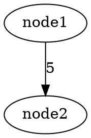

# TP C++ n°4 - Analyse de Logs Apache
## Document de Spécification et Conception

---

## 1. ANALYSE DU PROBLÈME

### 1.1 Contexte
Le projet consiste à développer une application d'analyse de fichiers de logs Apache en C++. Les logs sont au format Apache Combined Log Format et contiennent des informations sur les requêtes HTTP effectuées sur un serveur web.

### 1.2 Format des logs Apache
Chaque ligne de log suit ce format :
```
IP - - [Date] "Méthode URL HTTP/Version" Code Taille "Referer" "UserAgent"
```

**Exemple :**
```
192.168.0.1 - - [08/Sep/2012:11:15:00 +0200] "GET /page2.html HTTP/1.1" 200 2000 "http://intranet-if.insa-lyon.fr/page1.html" "Mozilla/5.0"
```

**Décomposition :**
- **IP** : 192.168.0.1
- **Date/Heure** : 08/Sep/2012:11:15:00 +0200
- **Méthode** : GET
- **URL** : /page2.html
- **Protocole** : HTTP/1.1
- **Code retour** : 200
- **Taille** : 2000 octets
- **Referer** : http://intranet-if.insa-lyon.fr/page1.html
- **User Agent** : Mozilla/5.0

### 1.3 Objectifs fonctionnels attendus
1. **Parser les logs** : Extraire et structurer les informations de chaque ligne
2. **Analyser les données** : Calculer des statistiques sur les visites
3. **Gérer les ressources** : Différencier les documents HTML des ressources statiques (images, CSS, JS)
4. **Filtrage** : Permettre le filtrage par heure et exclusion des ressources statiques
5. **Génération de graphe** : Créer un fichier GraphViz représentant le parcours des utilisateurs

---

## 2. SPÉCIFICATION FONCTIONNELLE

### 2.1 Fonctionnalités principales

#### F1 : Top des documents les plus consultés
- **Entrée** : Fichier de logs
- **Sortie** : Liste des 10 documents les plus consultés avec leur nombre de hits
- **Format** : 
  ```
  /page1.html (150 hits)
  /page2.html (120 hits)
  ...
  ```

#### F2 : Génération de graphe de parcours
- **Entrée** : Fichier de logs
- **Sortie** : Fichier GraphViz (.dot) représentant le graphe de navigation
- **Structure** : 
  - Nœuds = Pages web
  - Arcs = Transitions entre pages (avec compteur de hits)
  - Format : `page1 -> page2 [label="5"];`

#### F3 : Filtrage par heure
- **Option** : `-t heure`
- **Comportement** : Ne considérer que les logs dans la plage [heure, heure+1[
- **Exemple** : `-t 12` considère les logs entre 12:00:00 et 12:59:59

#### F4 : Exclusion des ressources statiques
- **Option** : `-e`
- **Comportement** : Ignorer les requêtes vers des ressources statiques
- **Extensions à exclure** : .jpg, .jpeg, .png, .gif, .bmp, .css, .js, .ico, etc.

### 2.2 Interface utilisateur (ligne de commande)

```bash
./analog [options] fichier.log
```

**Options :**
- `-g fichier.dot` : Génère un fichier GraphViz
- `-e` : Exclut les ressources statiques de l'analyse
- `-t heure` : Filtre les logs sur une heure spécifique (0-23)

**Exemples d'utilisation :**
```bash
./analog anonyme.log
./analog -g graph.dot anonyme.log
./analog -e anonyme.log
./analog -t 11 anonyme.log
./analog -g graph.dot -e -t 11 anonyme.log
```

---

## 3. CONCEPTION ARCHITECTURALE

### 3.1 Architecture générale

```
┌─────────────┐
│    Main     │
│  (analog)   │
└──────┬──────┘
       │
       ├─────────────────────────────────┐
       │                                 │
       ▼                                 ▼
┌──────────────┐                  ┌─────────────┐
│ LogParser    │                  │   Options   │
│              │                  │   Manager   │
└──────┬───────┘                  └─────────────┘
       │
       ├──────────────┬────────────────┐
       │              │                │
       ▼              ▼                ▼
┌──────────┐    ┌──────────┐    ┌──────────┐
│  LogEntry│    │  Document│    │  Analyzer│
└──────────┘    └──────────┘    └──────────┘
                                      │
                                      ▼
                                ┌──────────────┐
                                │ GraphGenerator│
                                └──────────────┘
```

### 3.2 Diagramme de classes UML

```
┌─────────────────────────────────┐
│         LogEntry                │
├─────────────────────────────────┤
│ - ip : string                   │
│ - dateTime : DateTime           │
│ - method : string               │
│ - url : string                  │
│ - protocol : string             │
│ - statusCode : int              │
│ - size : int                    │
│ - referer : string              │
│ - userAgent : string            │
├─────────────────────────────────┤
│ + LogEntry(...)                 │
│ + GetUrl() : string             │
│ + GetReferer() : string         │
│ + GetDateTime() : DateTime      │
│ + IsStaticResource() : bool     │
└─────────────────────────────────┘

┌─────────────────────────────────┐
│         DateTime                │
├─────────────────────────────────┤
│ - day : int                     │
│ - month : string                │
│ - year : int                    │
│ - hour : int                    │
│ - minute : int                  │
│ - second : int                  │
│ - timezone : string             │
├─────────────────────────────────┤
│ + DateTime(...)                 │
│ + GetHour() : int               │
│ + ToString() : string           │
└─────────────────────────────────┘

┌─────────────────────────────────┐
│         LogParser               │
├─────────────────────────────────┤
│ - logEntries : list<LogEntry>   │
├─────────────────────────────────┤
│ + ParseFile(filename) : bool    │
│ + ParseLine(line) : LogEntry*   │
│ + GetEntries() : list<LogEntry> │
└─────────────────────────────────┘

┌─────────────────────────────────┐
│         Document                │
├─────────────────────────────────┤
│ - url : string                  │
│ - hitCount : int                │
├─────────────────────────────────┤
│ + Document(url)                 │
│ + IncrementHits()               │
│ + GetHitCount() : int           │
│ + GetUrl() : string             │
│ + operator<(other) : bool       │
└─────────────────────────────────┘

┌─────────────────────────────────┐
│         Analyzer                │
├─────────────────────────────────┤
│ - documents : map<string,       │
│               Document*>        │
│ - transitions : map<pair,int>   │
│ - excludeStatic : bool          │
│ - hourFilter : int              │
├─────────────────────────────────┤
│ + Analyze(entries)              │
│ + GetTopDocuments(n) : list     │
│ + GetTransitions() : map        │
│ + SetExcludeStatic(bool)        │
│ + SetHourFilter(int)            │
└─────────────────────────────────┘

┌─────────────────────────────────┐
│         GraphGenerator          │
├─────────────────────────────────┤
│ - transitions : map             │
│ - nodes : set<string>           │
├─────────────────────────────────┤
│ + GenerateGraph(filename)       │
│ + AddTransition(from,to,count)  │
└─────────────────────────────────┘

┌─────────────────────────────────┐
│         Options                 │
├─────────────────────────────────┤
│ - logFile : string              │
│ - graphFile : string            │
│ - excludeStatic : bool          │
│ - hourFilter : int              │
│ - generateGraph : bool          │
├─────────────────────────────────┤
│ + ParseCommandLine(argc,argv)   │
│ + GetLogFile() : string         │
│ + GetGraphFile() : string       │
│ + IsExcludeStatic() : bool      │
│ + GetHourFilter() : int         │
│ + IsGenerateGraph() : bool      │
└─────────────────────────────────┘
```

---

## 4. CONCEPTION DÉTAILLÉE

### 4.1 Classe LogEntry
**Responsabilité** : Représenter une entrée de log avec tous ses attributs

**Attributs :**
- `ip` : Adresse IP du client
- `dateTime` : Date et heure de la requête (objet DateTime)
- `method` : Méthode HTTP (GET, POST, etc.)
- `url` : URL demandée
- `protocol` : Protocole HTTP utilisé
- `statusCode` : Code de retour HTTP
- `size` : Taille de la réponse en octets
- `referer` : URL de provenance
- `userAgent` : Navigateur utilisé

**Méthodes :**
- `IsStaticResource()` : Détermine si l'URL pointe vers une ressource statique

### 4.2 Classe DateTime
**Responsabilité** : Gérer la date et l'heure d'une requête

**Attributs :**
- day, month, year, hour, minute, second, timezone

**Méthodes :**
- `GetHour()` : Retourne l'heure (0-23)
- Constructeur depuis string "[08/Sep/2012:11:15:00 +0200]"

### 4.3 Classe LogParser
**Responsabilité** : Parser le fichier de logs et créer les objets LogEntry

**Méthodes principales :**
- `ParseFile(filename)` : Lit le fichier ligne par ligne
- `ParseLine(line)` : Extrait les informations d'une ligne et crée un LogEntry
- Utilisation de regex ou parsing manuel pour extraire les champs

**Algorithme de parsing :**
```
1. Ouvrir le fichier
2. Pour chaque ligne :
   a. Extraire l'IP (jusqu'au premier espace)
   b. Extraire la date (entre crochets)
   c. Extraire la requête (entre guillemets)
   d. Extraire le code et la taille
   e. Extraire le referer (entre guillemets)
   f. Extraire le user agent (entre guillemets)
   g. Créer un objet LogEntry
3. Retourner la liste des LogEntry
```

### 4.4 Classe Document
**Responsabilité** : Représenter un document web avec son compteur de hits

**Méthodes :**
- `IncrementHits()` : Augmente le compteur
- `operator<` : Pour permettre le tri par nombre de hits

### 4.5 Classe Analyzer
**Responsabilité** : Analyser les logs et générer les statistiques

**Structures de données :**
- `map<string, Document*> documents` : URL → Document
- `map<pair<string,string>, int> transitions` : (URLSource, URLDest) → Compteur

**Algorithme d'analyse :**
```
1. Pour chaque LogEntry :
   a. Appliquer les filtres (heure, ressources statiques)
   b. Si valide :
      - Incrémenter le hit count du document
      - Si referer non vide et local :
        * Incrémenter le compteur de transition (referer → url)
2. Trier les documents par hit count
3. Retourner le top 10
```

**Critères de filtrage :**
- Filtre heure : `entry.GetDateTime().GetHour() == hourFilter`
- Filtre ressources : `!entry.IsStaticResource()`
- Referer local : Le referer commence par le domaine du site

### 4.6 Classe GraphGenerator
**Responsabilité** : Générer le fichier GraphViz .dot

**Format de sortie :**
```dot
digraph {
    "/page1.html";
    "/page2.html";
    "/page3.html";
    "/page1.html" -> "/page2.html" [label="5"];
    "/page2.html" -> "/page3.html" [label="3"];
    ...
}
```

**Algorithme :**
```
1. Écrire "digraph {"
2. Pour chaque nœud unique :
   - Écrire "URL"
3. Pour chaque transition (source, dest, count) :
   - Écrire "source" -> "dest" [label="count"];
4. Écrire "}"
```

### 4.7 Classe Options
**Responsabilité** : Parser et stocker les options de la ligne de commande

**Algorithme de parsing :**
```
1. Parcourir argv
2. Si argv[i] == "-g" :
   - graphFile = argv[i+1]
   - generateGraph = true
3. Si argv[i] == "-e" :
   - excludeStatic = true
4. Si argv[i] == "-t" :
   - hourFilter = atoi(argv[i+1])
5. Dernier argument = logFile
```

---

## 5. STRUCTURES DE DONNÉES

### 5.1 Choix des conteneurs STL

**Pour stocker les documents :**
- `std::map<std::string, Document*>`
- Justification : Accès rapide par URL (O(log n)), insertion automatique

**Pour stocker les transitions :**
- `std::map<std::pair<std::string, std::string>, int>`
- Justification : Paire (source, dest) comme clé unique

**Pour le top 10 :**
- `std::vector<Document*>` trié avec `std::sort`
- Justification : Tri efficace, accès direct aux 10 premiers

**Pour les nœuds du graphe :**
- `std::set<std::string>`
- Justification : Unicité automatique des URLs

### 5.2 Gestion de la mémoire

**Règles :**
1. Les LogEntry peuvent être alloués dynamiquement ou stockés par valeur
2. Les Document sont alloués dynamiquement et stockés dans la map
3. Libération dans le destructeur de Analyzer
4. Utilisation possible de smart pointers (C++11) : `std::shared_ptr`, `std::unique_ptr`

---

## 6. ALGORITHMES CLÉS

### 6.1 Détection des ressources statiques

```cpp
bool LogEntry::IsStaticResource() const {
    static const std::vector<std::string> extensions = {
        ".jpg", ".jpeg", ".png", ".gif", ".bmp", 
        ".css", ".js", ".ico", ".svg"
    };
    
    for (const auto& ext : extensions) {
        if (url.length() >= ext.length() &&
            url.compare(url.length() - ext.length(), 
                       ext.length(), ext) == 0) {
            return true;
        }
    }
    return false;
}
```

### 6.2 Extraction du domaine local du referer

```cpp
bool IsLocalReferer(const string& referer, const string& baseUrl) {
    // Vérifier si le referer commence par le domaine du site
    // Ex: "http://intranet-if.insa-lyon.fr/..."
    return referer.find(baseUrl) == 0;
}
```

### 6.3 Parsing d'une ligne de log (regex)

```cpp
// Pattern regex pour le format Apache Combined Log
// IP - - [Date] "Method URL Protocol" Code Size "Referer" "UserAgent"
std::regex pattern(
    R"(^(\S+) - - \[([^\]]+)\] \"(\S+) (\S+) (\S+)\" (\d+) (\S+) \"([^\"]*)\" \"([^\"]*)\"$)"
);

std::smatch matches;
if (std::regex_match(line, matches, pattern)) {
    // matches[1] = IP
    // matches[2] = DateTime
    // matches[3] = Method
    // matches[4] = URL
    // matches[5] = Protocol
    // matches[6] = StatusCode
    // matches[7] = Size
    // matches[8] = Referer
    // matches[9] = UserAgent
}
```

---

## 7. MODULARISATION

### 7.1 Fichiers du projet

```
analog/
├── src/
│   ├── main.cpp              # Point d'entrée, orchestration
│   ├── LogEntry.h/.cpp       # Classe LogEntry
│   ├── DateTime.h/.cpp       # Classe DateTime
│   ├── LogParser.h/.cpp      # Classe LogParser
│   ├── Document.h/.cpp       # Classe Document
│   ├── Analyzer.h/.cpp       # Classe Analyzer
│   ├── GraphGenerator.h/.cpp # Classe GraphGenerator
│   └── Options.h/.cpp        # Classe Options
├── tests/
│   └── ... (fichiers de tests)
└── Makefile
```

### 7.2 Dépendances entre modules

```
main.cpp
  ├─> Options
  ├─> LogParser
  │    └─> LogEntry
  │         └─> DateTime
  ├─> Analyzer
  │    ├─> LogEntry
  │    └─> Document
  └─> GraphGenerator
```

---

## 8. GESTION DES ERREURS

### 8.1 Erreurs à gérer

1. **Fichier inexistant**
   - Message : "Erreur : impossible d'ouvrir le fichier 'filename'"
   - Action : Quitter avec code d'erreur

2. **Ligne de log mal formée**
   - Action : Ignorer la ligne, continuer le traitement
   - Option : Afficher un warning

3. **Options invalides**
   - Heure hors plage (< 0 ou > 23)
   - Fichier .dot non accessible en écriture
   - Message d'erreur approprié

4. **Mémoire insuffisante**
   - Gestion des exceptions `std::bad_alloc`

### 8.2 Validation des données

- Vérifier que l'heure est dans [0, 23]
- Vérifier que les pointeurs ne sont pas NULL
- Vérifier que les URLs sont valides (non vides)

---

## 9. TESTS

### 9.1 Tests unitaires

**LogEntry :**
- Test de parsing d'une ligne valide
- Test IsStaticResource() pour différentes extensions
- Test avec ligne mal formée

**DateTime :**
- Test de parsing de différents formats de date
- Test GetHour()

**Document :**
- Test IncrementHits()
- Test comparaison pour tri

**Analyzer :**
- Test avec filtrage par heure
- Test avec exclusion ressources statiques
- Test calcul du top 10
- Test détection des transitions

**GraphGenerator :**
- Test génération d'un fichier .dot valide
- Test avec graphe vide
- Test avec multiples transitions

### 9.2 Tests d'intégration

1. Test avec le fichier exemple-mini-non-exhaustif.txt
2. Test avec le fichier anonyme.log complet
3. Test de toutes les combinaisons d'options
4. Vérification que le .dot généré est valide (compilation avec Graphviz)

### 9.3 Cas de test

**Test 1 : Top 10 sans options**
```bash
./analog anonyme.log
```
Vérifier l'affichage du top 10 des documents

**Test 2 : Génération graphe**
```bash
./analog -g graph.dot anonyme.log
dot -Tpng graph.dot -o graph.png
```
Vérifier que graph.png est généré correctement

**Test 3 : Filtrage heure**
```bash
./analog -t 11 anonyme.log
```
Vérifier que seuls les logs de 11h sont considérés

**Test 4 : Exclusion ressources statiques**
```bash
./analog -e anonyme.log
```
Vérifier que les .jpg, .css, etc. n'apparaissent pas

**Test 5 : Toutes options combinées**
```bash
./analog -g graph.dot -e -t 11 anonyme.log
```

---

## 10. OPTIMISATIONS POSSIBLES

### 10.1 Performance

1. **Lecture du fichier**
   - Utiliser un buffer pour la lecture
   - Éviter les copies inutiles de strings

2. **Parsing**
   - Pré-compiler les regex
   - Utiliser des string_view (C++17) pour éviter les copies

3. **Stockage**
   - Réserver de la mémoire pour les conteneurs
   - Utiliser move semantics (C++11)

4. **Tri**
   - Utiliser std::partial_sort si on ne veut que le top 10

### 10.2 Mémoire

1. Libérer progressivement les LogEntry après traitement
2. Utiliser des références plutôt que des copies
3. Smart pointers pour éviter les fuites

---

## 11. EXTENSIBILITÉ

### 11.1 Évolutions possibles

1. **Nouveaux filtres**
   - Par code de retour HTTP (200, 404, etc.)
   - Par IP source
   - Par plage de dates

2. **Nouvelles statistiques**
   - Distribution temporelle des requêtes
   - Statistiques par User Agent
   - Pages d'entrée/sortie

3. **Nouveaux formats de sortie**
   - Export CSV
   - Export JSON
   - Génération HTML

4. **Support de formats de logs différents**
   - Apache Common Log Format
   - Nginx logs
   - IIS logs

### 11.2 Architecture extensible

- Utiliser des interfaces/classes abstraites pour les générateurs de graphes
- Pattern Strategy pour les différents types d'analyses
- Pattern Factory pour créer les parsers selon le format

---

## 12. CONTRAINTES TECHNIQUES

### 12.1 Langage et normes

- **C++ standard** : C++98 minimum, C++11 recommandé
- **Compilateur** : g++ avec option `-std=c++11`
- **Style** : Guide de style C++ INSA (voir SClasse.h et SClasse.cpp)

### 12.2 Bibliothèques autorisées

- **STL** : Tous les conteneurs et algorithmes
- **Regex** : `std::regex` (C++11) ou parsing manuel
- **Entrées/sorties** : `iostream`, `fstream`

### 12.3 Environnement

- **OS** : Linux (tests sur machines de l'école)
- **Build** : Makefile
- **Tests** : Framework fourni (Tests.tgz)

---

## 13. CHECKLIST DE RÉALISATION

### Phase 1 : Classes de base
- [ ] Créer DateTime.h/.cpp
- [ ] Créer LogEntry.h/.cpp
- [ ] Créer Document.h/.cpp
- [ ] Tests unitaires des classes de base

### Phase 2 : Parsing
- [ ] Créer LogParser.h/.cpp
- [ ] Implémenter ParseLine()
- [ ] Implémenter ParseFile()
- [ ] Tests de parsing

### Phase 3 : Analyse
- [ ] Créer Analyzer.h/.cpp
- [ ] Implémenter calcul du top 10
- [ ] Implémenter détection des transitions
- [ ] Implémenter les filtres
- [ ] Tests d'analyse

### Phase 4 : Génération graphe
- [ ] Créer GraphGenerator.h/.cpp
- [ ] Implémenter génération .dot
- [ ] Tests de génération

### Phase 5 : Interface
- [ ] Créer Options.h/.cpp
- [ ] Créer main.cpp
- [ ] Tests d'intégration

### Phase 6 : Finalisation
- [ ] Makefile
- [ ] Documentation
- [ ] Tests complets
- [ ] Vérification des normes de codage

---

## ANNEXES

### A. Format GraphViz DOT



Pour générer l'image :
```bash
dot -Tpng graph.dot -o graph.png
```

### B. Regex pour le format Apache

Pattern complet :
```
^(\S+) - - \[([^\]]+)\] \"(\S+) (\S+) (\S+)\" (\d+) (\S+) \"([^\"]*)\" \"([^\"]*)\"$
```

### C. Extensions de ressources statiques

Images : .jpg, .jpeg, .png, .gif, .bmp, .svg, .ico, .webp
Styles : .css
Scripts : .js
Polices : .woff, .woff2, .ttf, .eot

---

**Document réalisé le : 13 janvier 2026**
**Version : 1.0**
